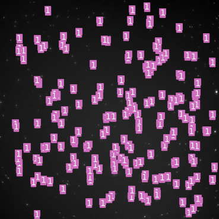
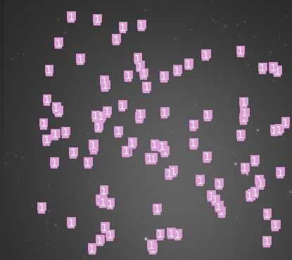

# 量子点目标检测

## 1.摘要 

​      本项目旨在对图像中的量子点进行检测，并计算出其中的量子点数量。实现过程包括数据准备、数据预处理、模型训练和模型预测。数据准备阶段使用labelme标注工具对数据标记位置，得到数据集。数据预处理阶段将点转换为方框，并将标签都改为1，然后对每张图片进行裁剪作为训练数据。模型训练使用Yolov3模型，首先根据JSON文件生成适配Yolov3的文件，并进行必要的参数修改。最后模型预测根据输出的模型对测试数据集进行测试，能够较为准确的输出白点个数。

## 2.数据准备

​     数据准备阶段使用了labelme标注工具，通过手动标注图片中的白点并生成对应的JSON文件。这些JSON文件包含了白点的位置信息以及标签等其它相关信息。同时为增加训练数据的多样性，针对每张图片，随机裁剪出10张子图作为训练数据。

## 3.实现方法

1、数据预处理阶段：

（1）将点转换为方框和将所有标签都改为1：遍历每个点的标注信息，获取点的坐标；根据点坐标构造方框的标注信息，包括方框的左上角和右下角坐标；修改形状的坐标信息为方框的标注信息，同时将形状类型修改为rectangle；并且同时将label类型都改为1.最后将更新后的标注信息保存到新的JSON文件中，以便将问题转化为检测问题。

（2）随机裁剪图片：随机选择裁剪位置对图像进行裁剪，并调整裁剪后的图像大小为416x416。遍历原始JSON数据中的每个rectangle。检查其中的点坐标是否在裁剪后的图像范围内。若在，则根据裁剪位置和尺寸，调整点坐标，并将更新后的点坐标添加到新的JSON数据中。

2、模型训练阶段：

(1)Yolov3模型训练：使用Yolov3模型进行训练，该模型在目标检测任务上表现良好，对小目标检测也有一定的友好性。首先要根据JSON文件生成适配Yolov3模型的文件，以便进行训练。

(2)参数修改：由于我们的任务是单目标检测，需要对Yolov3模型的参数进行适当的修改，以满足任务的需求。

(3)训练设置：由于GPU和显卡限制，采用较小的批量大小（batch_size=2）和适当的训练轮数（epoch=100）进行模型训练。

3、模型预测阶段：

使用训练好的Yolov3模型对测试数据集进行预测。能够较为准确地输出白点的个数。

## 4.评价指标

经过模型训练和预测，我们的模型能够较为准确输出白点的个数，并在原图上标记出来。以下展示两张标记好的图片以及输出所有图片预测的个数分别如图1，图2，图3所示。  

 

​                                    **图1.006.png**

​                                    **图2.011.png**

​                                           **图3：预测白点个数**

## 5.总结与不足

在本次大作业中我们使用了YOLOV3来进行量子点检测。YOLOV3虽然对小物体友好点了。但是对堆叠在一起的小物体检测能力想对较弱，需要对网络结构进行改善，我的想法是最好改成专用于量子点这类小物体的检测，包括每一个scale的anchor box,损失函数等等。还有不足就是数据集的问题，数据集的质量非常重要，应该增加数据集的规模，提升模型的泛化能力，也可以将数据切割，数据增强来提高数据的质量。最后一点就是的debug能力太差了，遇到问题花很长时间才能解决。